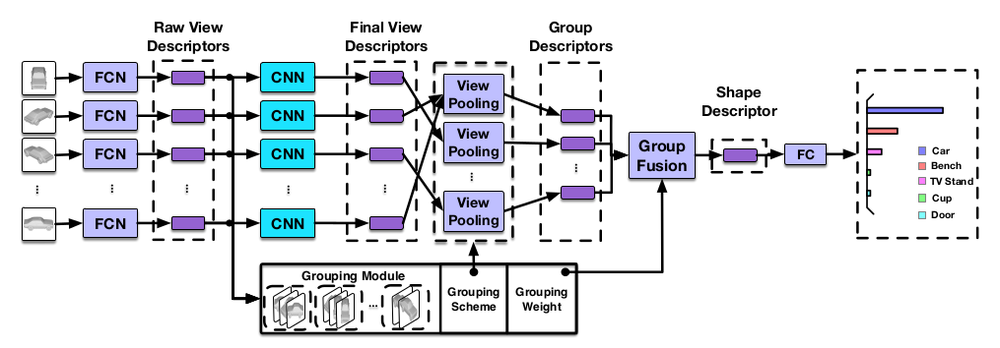

# On debugging.
- Multi GPU.
- balance sampler
- N batch
- Bugfix

## GVCNN (Group-View Convolutional Neural Networks for 3D Shape Recognition)

## Data
- Download [modelnet10-Class Orientation-aligned Subset](http://modelnet.cs.princeton.edu/)
  - make .png images in order below
    - data_utils/make_views_dir.py
    - data_utils/off2obj.py (after 'sudo apt install openctm-tools')
    - data_utils/obj2png.py
  - Or You can create 2D dataset from 3D objects (.obj, .stl, and .off), using [BlenderPhong](https://github.com/WeiTang114/BlenderPhong).
- Or Downsized modelnet40(from https://drive.google.com/file/d/0B4v2jR3WsindMUE3N2xiLVpyLW8/view) to modelnet12/6-view. 

## Quick Start
- make group-view image tfrecord file
  - dataset_tools/create_modelnet_tf_record.py
- train.py 
  - Note that the value (batch_size // num_gpu) should not be 0.

## Retrieval
- For training efficiency, it was implemented at the [here 1](https://github.com/ace19-dev/mvcnn-tf) and [here 2](https://github.com/ace19-dev/image-retrieval-tf)

## Caution.
- It had better use lighter model or decrease view number because it needs a big resources.

## References from
- http://openaccess.thecvf.com/content_cvpr_2018/papers/Feng_GVCNN_Group-View_Convolutional_CVPR_2018_paper.pdf
- https://github.com/WeiTang114/MVCNN-TensorFlow
- https://github.com/pclausen/obj2png
- https://github.com/ildoonet/tf-mobilenet-v2
- http://openresearch.ai/t/nccl-efficient-tensorflow-multigpu-training/159

